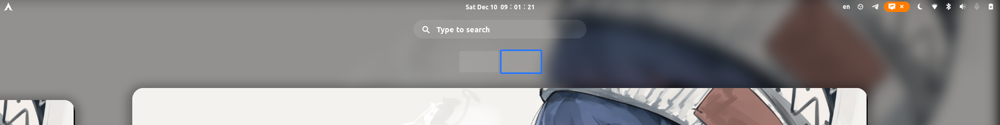

# Flat-Remix-Blue-Modification
## Instruction
Removed global text shadow, icon shadow, top bar shadow and reduced top bar icon spacing based on Flat-Remix-Blue-fullPanel theme from [flat-remix-gnome](https://github.com/daniruiz/flat-remix-gnome).
### Different from Flat-Remix-Blue-fullPanel
- Removed global text shadow, icon shadow, top bar shadow.
- Reduced top bar icon spacing. (See gnome-shell.css 1487 line)
- Modify the user name color from white to grey due to [Big-Avatar-Gnome-Shell-Extension](https://github.com/GustavoPeredo/Big-Avatar-Gnome-Shell-Extension/issues/5#issuecomment-871584443) issue. (See gnome-shell.css 2608 line)
### Shell theme comparison
#### Flat-Remix-Blue-fullPanel

#### Flat-Remix-Blue-fullPanel-Mod-by-Cyunrei

## Install theme and login theme (Global)
- Ubuntu `sudo apt install libglib2.0-dev-bin imagemagick`
- Fedora `sudo dnf install glib2-devel ImageMagick`
- Arch `sudo pacman -S glib2 imagemagick`
### Gnome >= 40
```shell
$ git clone https://github.com/Cyunrei/Flat-Remix-Blue-Modification.git
$ cd Flat-Remix-Blue-Modification
$ make && sudo make install
```
### Gnome < 40
See the project [old branch](https://github.com/Cyunrei/Flat-Remix-Blue-Modification/tree/old#flat-remix-blue-modification).
## Uninstall theme and login theme (Global)
```shell
$ sudo make uninstall
```
## Install theme (User)
### Gnome >= 40
```shell
$ git clone https://github.com/Cyunrei/Flat-Remix-Blue-Modification.git
$ cd Flat-Remix-Blue-Modification
$ make install_user
```
## Uninstall theme (User)
```shell
$ make uninstall_user
```